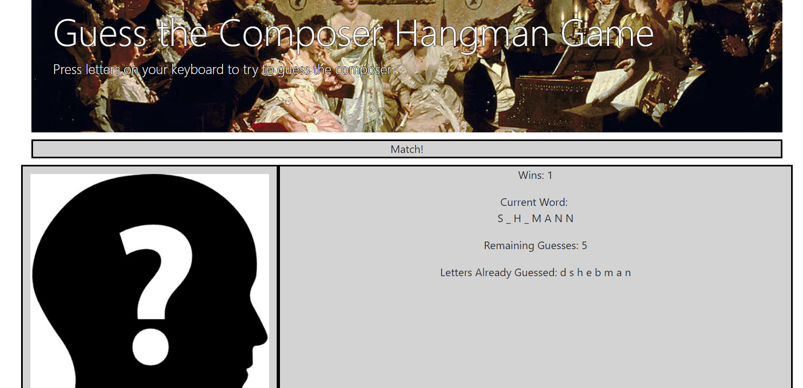

# Hangman-Game

## Coding Bootcamp Project

Hangman-Game is a browser-based application that uses JavaScript to create an interactive hangman game. In this version, the javascript generates the name of a random classical music composer from an array and displays a corresponding number of blanks on the page. If the user guesses correctly, the letter appears in the correct place in blanks displayed. If a name is completed, the user wins and a picture of the composer appears on the screen. The user can play until he or she has run out of guesses, at which point the total number of wins is displayed.

Screenshot:

